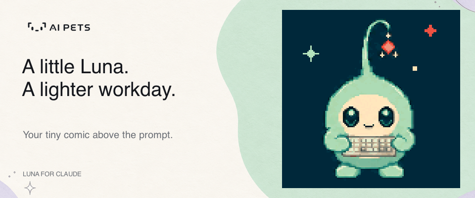
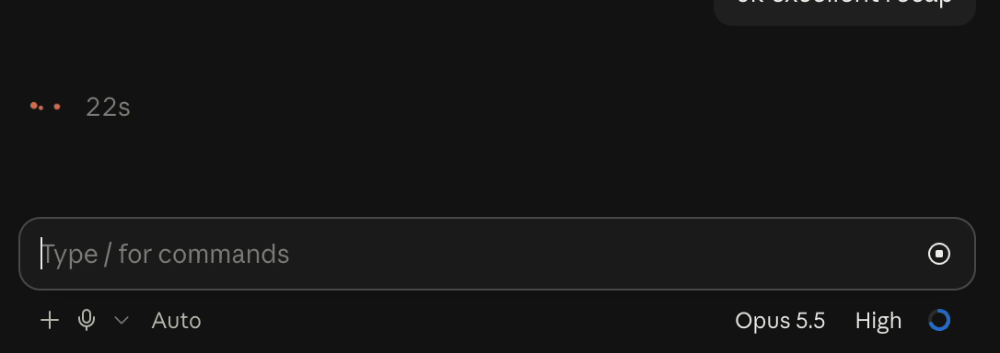
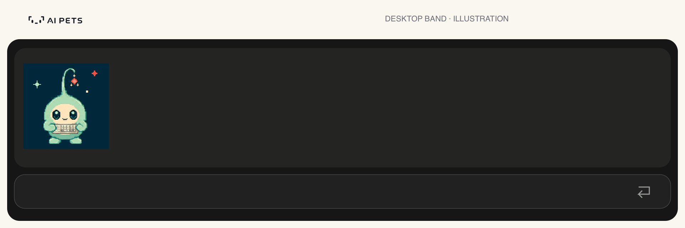
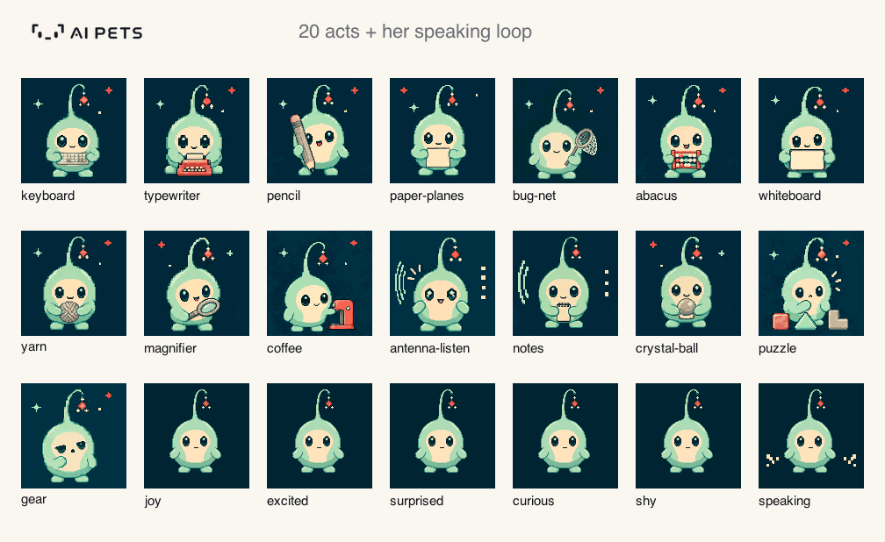
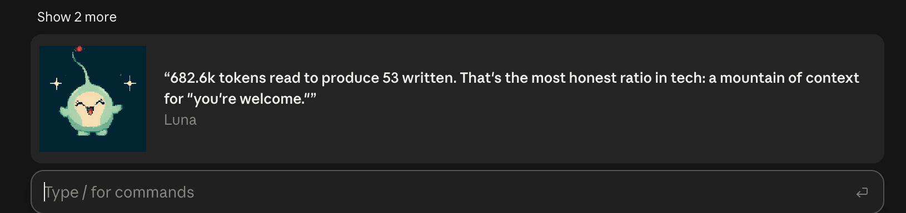
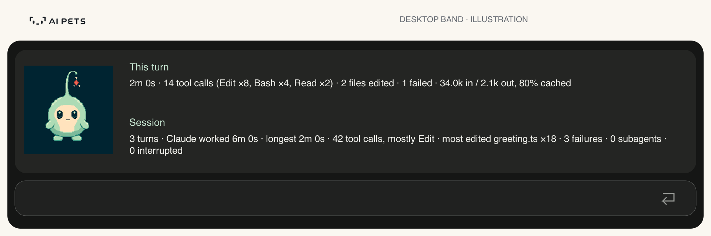
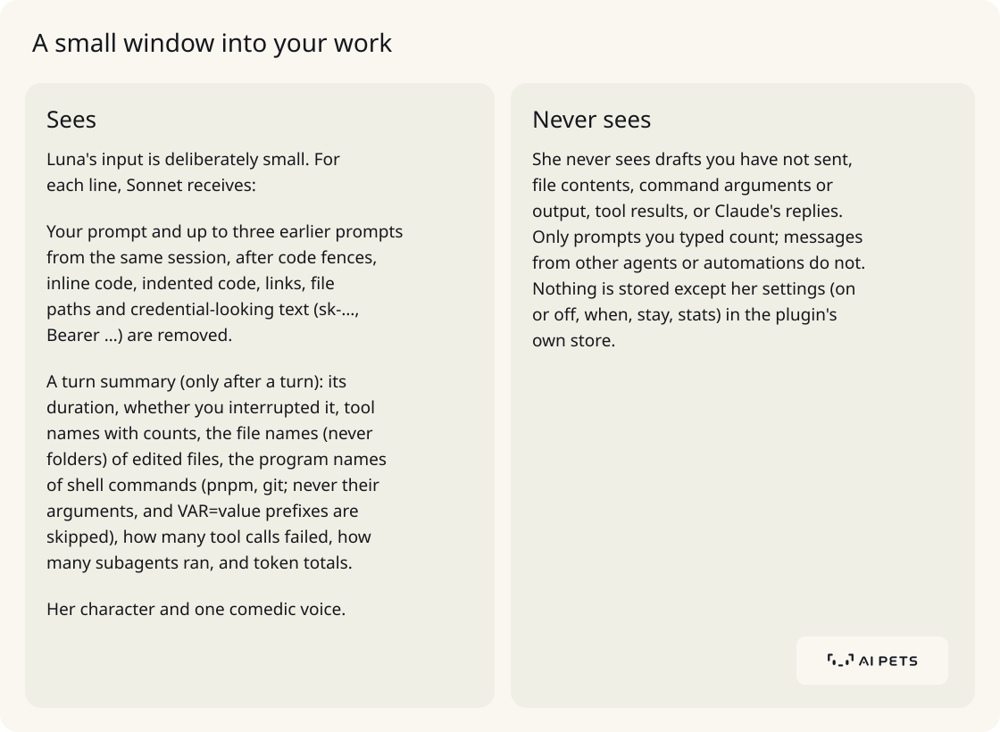
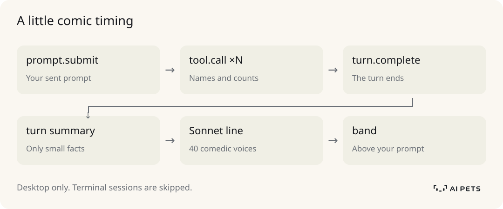

# Luna for Claude

Luna is a tiny pixel-art sprout from [AI Pets](https://aipets.com) who lives
above your prompt in the Claude desktop app. When Claude finishes a turn she
pops up, plays one of her animations and cracks a joke about what you asked and
what Claude just did about it: how long it took, which tools ran, which files
changed, what failed. Then she tucks herself away again.

She is a stand-up comic first and your biggest fan underneath. Every line comes
in a different comedic voice, from bone-dry deadpan to roasts, anti-jokes and
bleakly honest confessions, and Claude (Sonnet) writes it with your existing
Claude login. There is no server, no account and no API key.



> Public beta by [AI Pets](https://aipets.com). [Read the story](https://aipets.com/blog/ai-pets-for-claude).

**See Luna in action**



*A 12-second excerpt from a real desktop session, played at its original speed.*

Some real lines:

> "Two minutes and fourteen edits to change one word. You didn't rename a
> function, you threw it a full witness-protection relocation."

> "Almost seven minutes to learn why a test sometimes lets you in and sometimes
> doesn't. That's just dating, but with pnpm and three failures."

> "Wow, 'test.' Such ambition. Two seconds, zero tools, 34 thousand tokens read
> just to say hello back. Honestly, I'm proud of us."

## Contents

- [What she does](#what-she-does)
- [Requirements](#requirements)
- [Install](#install)
- [Using Luna](#using-luna)
- [What Luna sees](#what-luna-sees)
- [How it works](#how-it-works)
- [Repository layout](#repository-layout)
- [Development](#development)
- [Releasing a new version](#releasing-a-new-version)
- [Troubleshooting](#troubleshooting)

## What she does



*Illustration of the desktop band, using recorded Luna frames and a real line
from this README. [Still image](docs/images/luna-band.png).*

- **Reacts to your turns.** After Claude finishes, Luna appears in the band
  directly above the prompt box with one of twenty animations, then says one
  line beside it. A few seconds later she collapses on her own.
- **Never repeats herself.** Each appearance picks a random clip (her fifteen
  approved performances, such as keyboard, typewriter, bug net, coffee and
  crystal ball, plus five emotion moments), skipping the five shown last. Each
  line uses one of 40 comedic voices, skipping the ten used last.
- **Knows the session.** She sees your last few prompts, so she can call back
  to earlier ones ("third rename this hour…").
- **Shows stats nobody else shows.** In stats mode she stays docked with this
  turn's and the session's numbers: time, tool calls, edits, failures, tokens
  and cache hits, busiest tool, most-edited file, subagents, interruptions.
- **Stays out of the terminal.** Terminals can only draw her as coarse
  coloured blocks, so she appears in the desktop app's Code tab only. Terminal
  sessions run without her and make no requests on her behalf.



*Her twenty acts, plus the speaking loop. [Static gallery](docs/images/luna-clips.png).*

<details>
<summary>See Luna in the actual desktop app</summary>



*Real desktop screenshot supplied by Jay, shown without retouching.*

</details>

## Requirements

- macOS with the **Claude desktop app** (Code tab). She draws nowhere else.
- Claude Code **2.1.287 or newer** with mods enabled.
- A Claude plan. Each of Luna's lines is one small Sonnet request on it.
- For development only: Node 24+ and pnpm 9.15.0.

## Install

### From the release bundle

Download `aipets-claude-0.6.0-beta.zip` from the
[latest release](https://github.com/veiovi/aipets-claude/releases/latest), then:

```sh
mkdir -p ~/luna && cd ~/luna
unzip /path/to/aipets-claude-0.6.0-beta.zip
claude plugin marketplace add ~/luna/aipets-claude
claude plugin install aipets@aipets
```

Keep the extracted folder where it is: Claude reads the plugin from it. The
bundle contains the plugin, this README, the docs and a `release.json` listing
the SHA-256 of every file and the commit it was built from.

### From source

```sh
git clone https://github.com/veiovi/aipets-claude.git
cd aipets-claude
pnpm install --frozen-lockfile
pnpm build
claude plugin marketplace add "$PWD"
claude plugin install aipets@aipets
```

`pnpm build` is required: Luna's frames (`plugin/luna/`) are generated, not
checked in.

If you used the earlier private beta, first remove its old installation with
`claude plugin uninstall aipets@aipets-private` and
`claude plugin marketplace remove aipets-private`, then install the public
bundle. The public marketplace is named `aipets`.

Restart the Claude desktop app (or open a new Code session) after installing.
Send any prompt; when Claude finishes, Luna appears.

### Uninstall

```sh
claude plugin uninstall aipets@aipets
claude plugin marketplace remove aipets
```

## Using Luna

### Commands

Everything is set with `/aipets` in the Code tab. Choices are remembered across
sessions; `/aipets` on its own shows her current setup.

| Command | What it does |
| --- | --- |
| `/aipets` | Turns Luna on (she is on by default) and shows her settings. |
| `/aipets when done` | She shows up after Claude finishes a turn (default). |
| `/aipets when prompt` | She shows up as soon as you send a prompt. |
| `/aipets when both` | Both: when you send a prompt and again after Claude finishes. |
| `/aipets stay 5` | She stays 5 seconds after her line (default). Also `10` or `30`. |
| `/aipets stay next` | She stays until your next prompt. |
| `/aipets stats` | Toggles stats mode. |
| `/aipets off` | Sends her to rest. `/aipets` brings her back. |

When she shows up as you send a prompt, she only knows the prompt, so she jokes
about what you asked. After the turn she also knows what Claude did. With
`when both` you get two lines per turn (and two Sonnet requests).

### Stats mode

With `/aipets stats` on, Luna does not collapse, whatever `stay` is set to.
After each turn she plays her animation twice, says her line, then holds still
beside two rows:

- **This turn**: duration (and whether you interrupted it), tool calls with
  the busiest tools, files edited, failed calls, tokens in and out, and the
  share served from cache.
- **Session**: turns, total and longest time Claude worked, tool calls and
  the busiest tool, the most-edited file, failures, subagents, interruptions.

Session numbers reset when the session ends or you `/clear`.



*Stats-mode illustration with made-up events, formatted by the mod's own
`statRows()` function.*

## What Luna sees

Luna's input is deliberately small. For each line, Sonnet receives:

- **Your prompt** and up to three earlier prompts from the same session, after
  code fences, inline code, indented code, links, file paths and
  credential-looking text (`sk-…`, `Bearer …`) are removed.
- **A turn summary** (only after a turn): its duration, whether you
  interrupted it, tool names with counts, the *file names* (never folders) of
  edited files, the *program names* of shell commands (`pnpm`, `git`; never
  their arguments, and `VAR=value` prefixes are skipped), how many tool calls
  failed, how many subagents ran, and token totals.
- **Her character and one comedic voice**.

She never sees drafts you have not sent, file contents, command arguments or
output, tool results, or Claude's replies. Only prompts you typed count;
messages from other agents or automations do not. Nothing is stored except her
settings (on or off, when, stay, stats) in the plugin's own store.

<picture>
  <source media="(prefers-color-scheme: dark)" srcset="docs/images/what-luna-sees-dark.svg">
  
</picture>

## How it works

<picture>
  <source media="(prefers-color-scheme: dark)" srcset="docs/images/how-it-works-dark.svg">
  
</picture>

In prompt mode, Luna can also react immediately after `prompt.submit`.

- **The mod** (`plugin/hooks/`) is a Claude Code mod: plain JavaScript hooks on
  Claude's events, running inside the app. It has no network access of its own;
  her lines come from `$.model.complete` on the session's own Claude client.
- **The animation** comes from Luna's real AI Pets frame packs, the same art
  and the same C/WASM player the AI Pets hardware uses. Mods cannot run
  WebAssembly, so `tools/render-luna.mjs` runs the player at build time and
  records each clip exactly as the runtime plays it (10 frames a second,
  120×120 pixels). The 320 distinct frames are palette-indexed and run-length
  encoded into `plugin/luna/frames.bin` (about 1.5 MB).
- **Drawing**: the mod decodes the frames once, turns the current frame into a
  small PNG, and draws it in the desktop band as an `Svg` with pixelated
  scaling, redrawing ten times a second only while she is moving.
- **The art is pinned.** `tools/verify-vendor.mjs` checks the SHA-256 of both
  frame packs, the player and its loader before every build, plus the human
  approval record for the fifteen performances. Provenance (source
  repositories and commits) is in `vendor/*/manifest.json` and
  [docs/implementation.md](docs/implementation.md).

## Repository layout

```
.claude-plugin/marketplace.json   the local marketplace ("aipets")
plugin/                           the Claude Code plugin itself
  .claude-plugin/plugin.json      name and version
  hooks/hooks.json                points Claude at register.js
  hooks/register.js               events, /aipets settings, timing, model call, drawing
  hooks/stats.js                  turn and session stats (names and counts only)
  hooks/humor.js                  the 40 comedic voices and the no-repeat picker
  hooks/activity.js               prompt filtering (code, links, credentials)
  hooks/luna.js                   frame decoding and PNG encoding
  luna/                           generated frames (pnpm build; not committed)
  tests/activity.test.ts          native mod tests (claude plugin test)
tools/
  render-luna.mjs                 records Luna's clips with the canonical player
  verify-vendor.mjs               checks every pinned vendor hash
  package.mjs                     builds the release zip
vendor/
  luna/                           Luna's publication pack, acting pack and approval
  device/                         the pinned frame player (compiler export)
docs/
  implementation.md               behaviour, frames, evidence and sources
  images/                        README visuals and their source record
AGENTS.md                         rules for coding agents working in this repo
```

## Development

```sh
pnpm install --frozen-lockfile
pnpm build                              # verify vendor hashes, record frames
pnpm test                               # native mod tests (claude plugin test)
claude plugin validate plugin --strict  # manifest and hook checks
```

Regenerate the README visuals after `pnpm build` with
`node tools/render-readme-visuals.mjs` (FFmpeg must be on your PATH). Art, logo, font and background provenance
are in [docs/images/SOURCES.md](docs/images/SOURCES.md).

### Trying a change live

The quickest loop is a Claude desktop Code session with mod hot reloading:

1. Load the plugin-authoring skill in a desktop Code session (or ask Claude to
   "make a mod"); it creates a dev-mods folder for that session and asks
   whether to enable hot reloading.
2. Copy `plugin/.claude-plugin`, `plugin/hooks` and `plugin/luna` into a
   folder named `aipets` inside it.
3. Every edit you copy over reloads Luna when the current turn ends.

`claude --plugin-dir ./plugin` also works for checking that the plugin loads,
but Luna stays hidden in a terminal by design.

### Tests

`plugin/tests/activity.test.ts` runs against Claude's real mod engine. It mocks
only the engine's side (files, clock, model, store) and checks:

- prompt filtering and stats privacy (no paths, arguments or secrets),
- that she reacts after a turn with the summary, on desktop only,
- that terminal-only sessions never call the model,
- `/aipets off`, stats mode, `when` and `stay`.

Mocked model answers are not evidence of how funny she is; judge new voices by
trying them live.

### Changing her

- **Her voices**: edit `HUMOR` in `plugin/hooks/humor.js`. Keep each entry one
  instruction long; the test expects 40 entries.
- **Her character**: edit `LUNA` in `plugin/hooks/register.js`.
- **Her model**: the `model:` field in `react()` (currently `sonnet`).
- **Her clips**: `tools/render-luna.mjs` lists the performances and emotion
  moments it records. New art belongs in the AI Pets device repository and
  arrives here as a pinned, hash-checked pack; do not edit frames by hand.

## Releasing a new version

1. Work on a branch; `main` only accepts squash-merged pull requests (a
   pre-push hook blocks direct pushes).
2. **Bump the version** in `plugin/.claude-plugin/plugin.json`, `package.json`
   and `tools/package.mjs`. Claude caches plugins by version: without a bump,
   `claude plugin update` keeps serving the old copy.
3. Run `pnpm build`, `pnpm test` and `claude plugin validate plugin --strict`.
4. Merge, then on a clean `main`: `pnpm package`. The zip lands in
   `.local/releases/` with a `release.json` of per-file hashes. It is never
   uploaded automatically.
5. To update an installed copy, extract the new zip over the old folder, then:

   ```sh
   claude plugin marketplace update aipets
   claude plugin update aipets@aipets
   ```

   and restart the desktop app's Code sessions.

## Troubleshooting

| Symptom | Fix |
| --- | --- |
| Luna never appears | Use the desktop app's Code tab (not a terminal). Run `/aipets` to see whether she is on and when she shows up. Restart the session after installing or updating. |
| She appears but says nothing | Her line waits for Sonnet; if none arrives within 20 seconds she leaves quietly. Check your Claude plan's usage. |
| An update did not take effect | The version was not bumped, so Claude kept its cached copy. Bump it, or uninstall and reinstall. |
| She stays too long or too short | `/aipets stay 5`, `10`, `30` or `next`; stats mode (`/aipets stats`) keeps her up. |
| She shows up twice per turn | She is set to `/aipets when both`; use `when done` or `when prompt`. |
| `pnpm build` fails with a hash mismatch | A vendor file changed. Restore it from git; new art must come in as a new pinned export. |

For the design record, evidence and sources, see
[docs/implementation.md](docs/implementation.md).

Made by [AI Pets](https://aipets.com). The code is [MIT licensed](LICENSE);
Luna's artwork and AI Pets branding have [separate terms](ASSETS.md).
